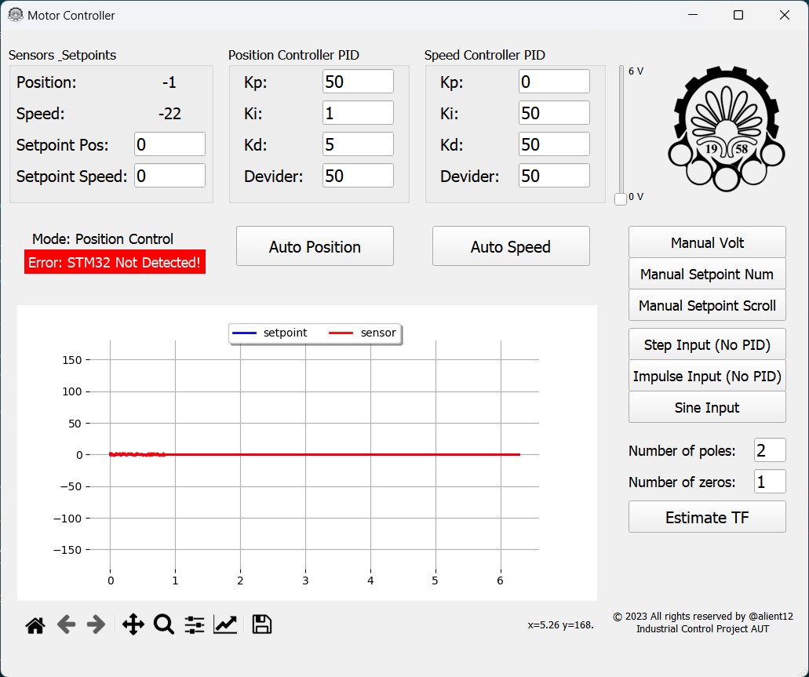
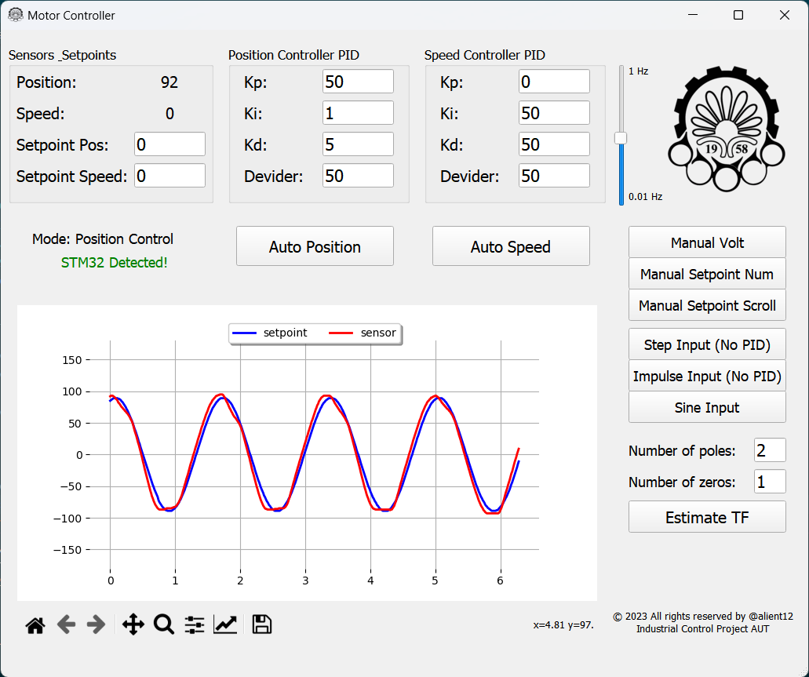
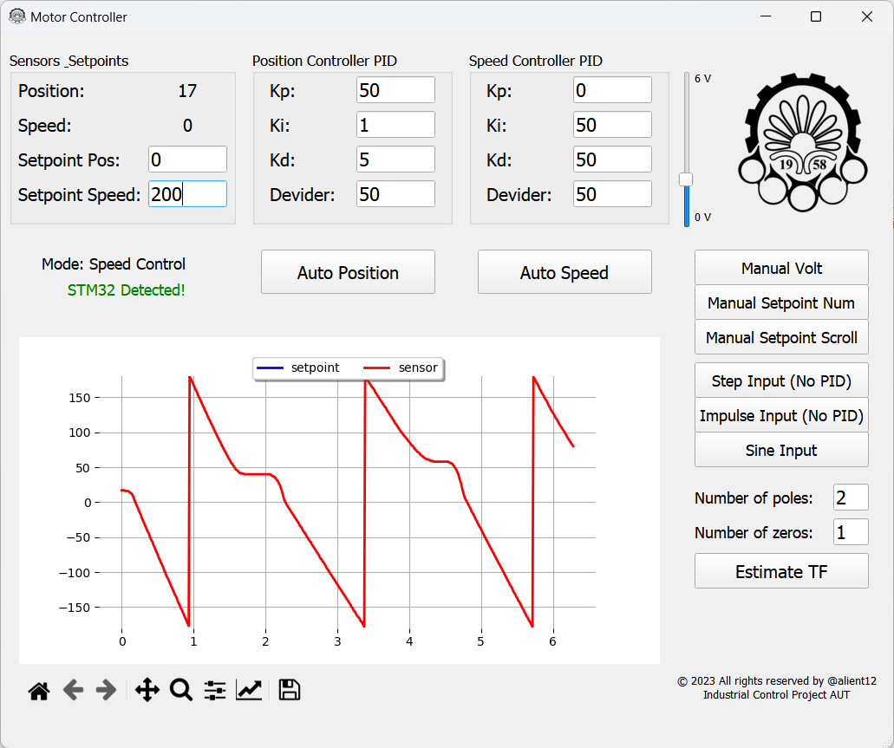

# DC_Motor_PID_Controller
PID controller for speed and position control of a 6v DC motor on stm32f401 and a fancy GUI with PyQt5 and real time output plot with ability to change PID and setpoint and estimate transfer function of motor!

|    |            |
|:----------:|:-------------:|
|  |  |
|  |  |
